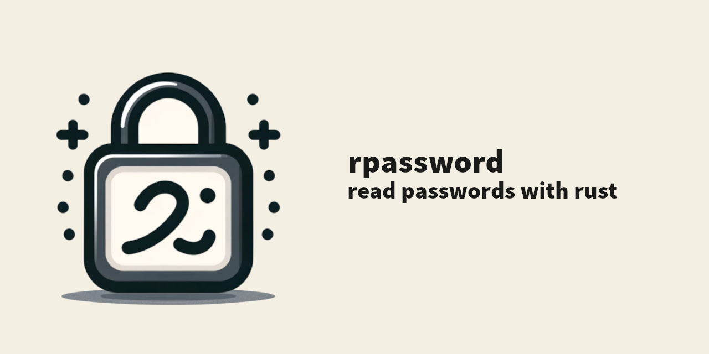

# Rustastic Password

`rpassword` makes it easy to read passwords from Rust code in console applications on all platforms, Unix, Windows, WASM and more.
It's similar to Linux's C function `getpass()` or Python's `getpass` module.



`rpassword` is made available free of charge. You can support its development through [Liberapay](https://liberapay.com/conradkleinespel/) 💪

## Usage

Add `rpassword` as a dependency in Cargo.toml:

```toml
[dependencies]
rpassword = "7.4"
```

See examples and docs at [https://docs.rs/rpassword](https://docs.rs/rpassword).

## License

The source code is released under the Apache 2.0 license.
